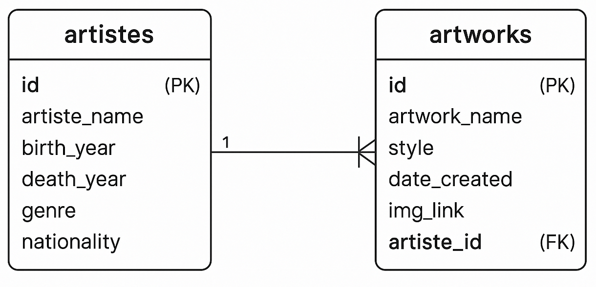

# Timeless Artists Hub Server

## Project Overview

This repository contains the backend server for the **Timeless Artists Hub** project. It provides API endpoints for managing artists and their artworks in a PostgreSQL database, including full CRUD functionality and proper relational linking between resources.

The server supports the frontend by delivering paginated and filtered data, handling user requests, and managing database persistence. Artworks are associated with artists via foreign key relationships, and cascading deletes ensure referential integrity.

## Tech Stack

- **Framework**: Node.js, Express
- **Database**: PostgreSQL
- **Deployment**: Render

## Features

- **RESTful API**: Provides clean and consistent endpoints for managing artist and artwork resources.
- **Full CRUD Support**: Includes create, read, update, and delete operations for both artists and artworks.
- **Relational Data Structure**: Implements a one-to-many relationship between artists and their artworks using foreign keys.
- **Cascading Deletes**: Automatically removes associated artworks when an artist is deleted, preserving database integrity.
- **Pre-Seeded Data**: Loads a curated collection of artwork metadata and artist bios.
- **Database Setup Scripts**: Includes SQL scripts for schema creation and data seeding to streamline development and deployment.

## Contents

- [Deployed Application](#deployed-application)
- [GitHub Repositories](#github-repositories)
- [Database Schema](#database-schema)
- [Installation and Setup](#installation-and-setup)
- [License](#license)
- [Contact](#contact)

## Deployed Application

- **Frontend App on Netlify**: [https://artistshub.netlify.app](https://artistshub.netlify.app)
- **Backend Server on Render**: [https://timeless-artists-hub-server.onrender.com](https://timeless-artists-hub-server.onrender.com)

## GitHub Repositories

- [Frontend Repository](https://github.com/jorammercado/timeless-artists-hub)
- [Backend Repository](https://github.com/jorammercado/timeless-artists-hub-server)
- [SQL Data Helper (json-to-sql)](https://github.com/jorammercado/timeless-artists-hub-sql-seed)

## Database Schema

The application uses a simple relational schema with two core tables:

- **artistes**: Stores artist information including name, biographical details, and optional links.
- **artworks**: Stores artwork entries associated with each artist, using a foreign key constraint and cascading deletes.

```sql
CREATE TABLE artistes (
  id SERIAL PRIMARY KEY,
  artiste_name VARCHAR(35) NOT NULL,
  birth_year INT,
  death_year INT,
  genre VARCHAR(50),
  nationality VARCHAR(35),
  bio TEXT,
  wikipedia_link TEXT,
  youtube_link TEXT,
  is_favorite BOOLEAN
);

CREATE TABLE artworks (
  id SERIAL PRIMARY KEY,
  artwork_name TEXT NOT NULL,
  artiste_name VARCHAR(35) NOT NULL,
  style VARCHAR(35),
  date_created VARCHAR(15),
  img_link TEXT,
  is_favorite BOOLEAN,
  artiste_id INTEGER REFERENCES artistes (id) ON DELETE CASCADE
);
```

### Entity Relationship Diagram (ERD)

Below is a simplified ERD showing the one-to-many relationship between artists and artworks:

<p align="center">
  
</p>

- **One artist** can have **many artworks**
- Each **artwork** belongs to **one artist**

## Installation and Setup

1. **Clone the repository:**

   ```bash
   git clone https://github.com/jorammercado/timeless-artists-hub-server.git
   cd timeless-artists-hub-server
   ```

2. **Install dependencies:**

   ```bash
   npm install
   ```

3. **Configure environment variables:**

   Create a `.env` file in the root directory with the following values:

   ```env
   PORT=5001
   PG_HOST=localhost
   PG_PORT=5432
   PG_DATABASE=artistes_dev
   PG_USER=postgres
   ```

   > Ensure PostgreSQL is installed and running locally with the specified credentials.
   > The default user provided must have permission to access and modify the local database.

4. **Initialize and seed the database:**

   ```bash
   npm run dbinit
   npm run dbseed
   ```

5. **Start the server:**

   ```bash
   npm start
   ```

## License

This project is licensed under the MIT License. See the [LICENSE](https://opensource.org/license/mit) for more information.

## Contact

For questions or feedback:

- Joram Mercado — [GitHub](https://github.com/jorammercado) | [LinkedIn](https://www.linkedin.com/in/jorammercado)